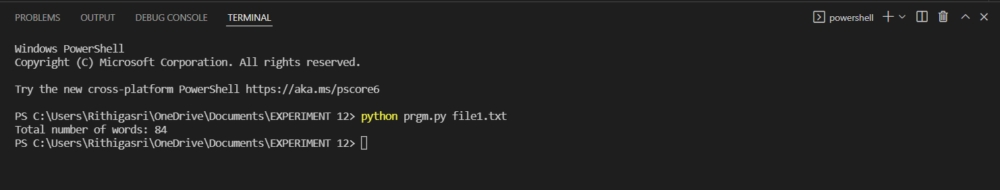

# COMMAND-LINE-ARGUEMENTS-TO-COUNT-WORD
## AIM:
To write a python program for getting the word count from the contents of a file using command line arguments.
## EQUIPEMENT'S REQUIRED: 
PC
Anaconda - Python 3.7
## ALGORITHM: 
### Step 1:
Import module sys.
### Step 2:
Open and read the file using open() and read() function. 
### Step 3: 
Split the content using split().
### Step 4:  
Open the terminal.
### Step 5: 
Pass python file name along with the opened file name as arguements in the terminal.
### Step 6: 
The terminal runs and gives the output.
## PROGRAM:
```
Dveveloped by:Rithiga Sri.B
Reference Number:21500732

import sys
fp=open(sys.argv[1])
data=fp.read()
word=data.split()
print("Total number of words:",len(word))
```
### OUTPUT:


## RESULT:
Thus the program is written to find the word count from the contents of a file using command line arguments.
